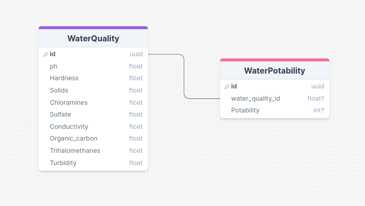

# water Quality Dataset

The dataset contains the following columns:
- ph
- Hardness
- Solids
- Chloramines
- Sulfate
- Conductivity
- Organic_carbon
- Trihalomethanes
- Turbidity
- Potability

### The schema will contain two tables:
- `WaterQuality`: This table will contain all the columns except `Potability`.
- `WaterPotability`: This table will contain the `Potability` information along with a foreign key linking to the `WaterQuality` table.

Here’s a possible design for the schema:
### Table: WaterQuality
- id (Primary Key)
- ph
- Hardness
- Solids
- Chloramines
- Sulfate
- Conductivity
- Organic_carbon
- Trihalomethanes
- Turbidity

### Table: WaterPotability
- id (Primary Key)
- water_quality_id (Foreign Key referencing WaterQuality(id))
- Potability

### Database
The database of choice is going to be postgresQl

# My Project

## Embedded Database Diagram

You can view the database diagram [here](https://drawsql.app/teams/ctrluganda-/diagrams/water-quality-database/embed).

<!-- HTML tags section (if supported by your Markdown renderer) -->
<iframe width="100%" height="500px" style="box-shadow: 0 2px 8px 0 rgba(63,69,81,0.16); border-radius:15px;" allowtransparency="true" allowfullscreen="true" scrolling="no" title="Embedded DrawSQL IFrame" frameborder="0" src="https://drawsql.app/teams/ctrluganda-/diagrams/water-quality-database/embed"></iframe>
